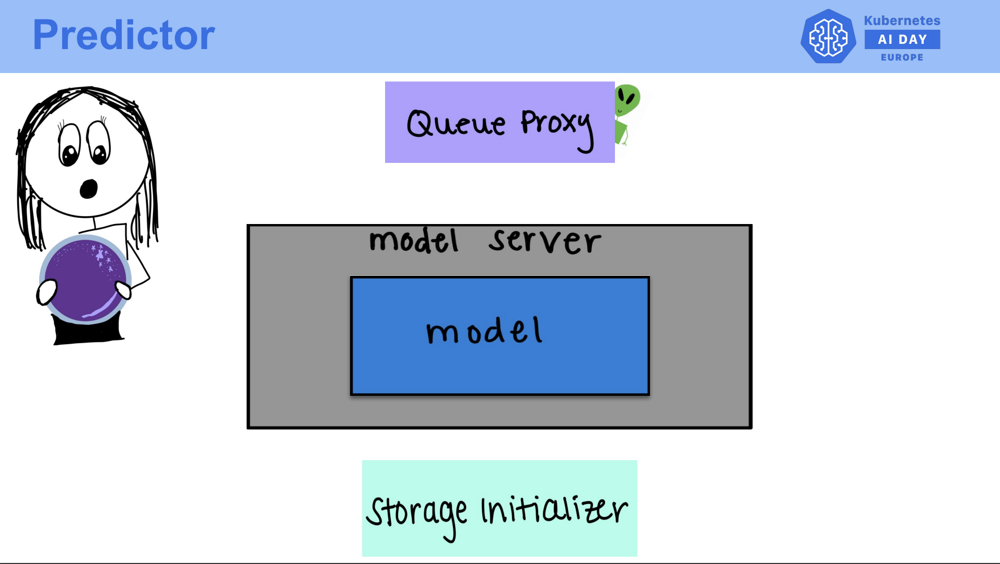

## **Deploying Your First Model with KServe**

Welcome to the ReadMe on deploying your first machine learning model using **KServe**. This tutorial will guide you through creating an **InferenceService** with a pre-trained **Scikit-learn Iris** model, understanding the YAML configuration, deploying the model, and sending test inference requests.

---

### **Understanding InferenceService YAML Configuration**

The **YAML configuration** is crucial as it defines how your model will be deployed and served in Kubernetes via KServe. Below are the key components of the configuration:

- **apiVersion**: Specifies the API version of KServe. This is essential for Kubernetes to understand what resources are being created or managed by KServe. For example, `serving.kserve.io/v1beta1` specifies that this is an InferenceService object compatible with this version of the KServe API.

- **kind**: Defines the type of Kubernetes resource. Here, it's set to `InferenceService`, which instructs Kubernetes that we are creating a service for model inference.

- **metadata**: Contains metadata like the **name** of the service (`sklearn-iris`) and the **namespace** (`kserve-test`) where the service will run. The namespace helps isolate resources within the Kubernetes cluster. The model will be deployed in this specific namespace.

- **spec**: This section defines the detailed specifications for the model deployment:
  - **predictor**: Specifies that we are using **Scikit-learn** as the model type. KServe will manage the container required to serve the Scikit-learn model.
  - **storageUri**: This is the URI pointing to the model's location in **Google Cloud Storage (GCS)** or any other object storage. KServe will pull the model from this location and deploy it.
  - **resources**: This defines how much CPU and memory are allocated for the model service. There are two sections:
    - **requests**: These are the minimum resources needed for the service to function.
    - **limits**: These define the maximum resources the service can use. For example, if CPU utilization exceeds `1` CPU, the service will be throttled.

---

Here is a snippet of the YAML file:

```yaml
apiVersion: serving.kserve.io/v1beta1
kind: InferenceService
metadata:
  name: sklearn-iris
  namespace: kserve-test
spec:
  predictor:
    sklearn:
      storageUri: "gs://kfserving-examples/models/sklearn/1.0/model"
      resources:
        requests:
          cpu: "500m"
          memory: "512Mi"
        limits:
          cpu: "1"
          memory: "1Gi"
```


### **Create a Namespace**

In Kubernetes, **namespaces** are used to organize resources. Since the `kserve-test` namespace is used in the YAML configuration, we need to create it manually because it does not exist by default.


```bash
kubectl create ns kserve-test
```


**Explanation**: This command creates a new namespace in your Kubernetes cluster. The namespace is an isolated environment where all the resources related to this deployment will exist. Namespaces are useful for keeping different projects, teams, or environments separated within a single cluster.

---

### **Deploying the Model**

After ensuring that the namespace is created and the YAML configuration is prepared, deploy your model using **kubectl** to apply the configuration.

```bash
kubectl apply -f sklearn-iris.yaml
```

**Explanation**: This step triggers the creation of an **InferenceService** in the Kubernetes cluster. KServe pulls the model from the specified `storageUri` and provisions the necessary resources to serve it. The **kubectl apply** command tells Kubernetes to create or update the specified resources based on the provided configuration file.

---

### **Verifying Deployment**

Once the model is deployed, check whether the **InferenceService** is running successfully.

```bash
kubectl get inferenceservices sklearn-iris -n kserve-test
```

**Explanation**: By running the verification command, you are querying Kubernetes to check the status of the deployed service. It will return the status of the service (e.g., `READY`) and display the endpoint URL that can be used to send inference requests to the model. If the service isn't ready, it indicates potential issues with the deployment.

---

### **Determine External Load Balancer Support**

To serve your model externally (outside of your Kubernetes cluster), ensure that your environment supports an external load balancer.

```bash
kubectl get svc istio-ingressgateway -n istio-system
```

**Explanation**: This command checks if the **Istio ingress gateway** service has an external IP assigned. If the `EXTERNAL-IP` field is populated, it means your Kubernetes cluster supports external load balancing, and external traffic can be routed to the deployed model. 

You will also need to set environment variables for the ingress host and port to route traffic correctly to the inference service.

```bash
export INGRESS_HOST=$(kubectl -n istio-system get service istio-ingressgateway -o jsonpath='{.status.loadBalancer.ingress[0].ip}')
export INGRESS_PORT=$(kubectl -n istio-system get service istio-ingressgateway -o jsonpath='{.spec.ports[?(@.name=="http2")].port}')
```

---

### **Sending Test Inference Requests**




Now that your model is deployed and exposed externally, you can send test inference requests. The inference request is sent using `curl` with a sample JSON input.

**Explanation**:
- **SERVICE_HOSTNAME**: This extracts the hostname for the deployed inference service. It will be used to route the request properly to the service.
  
- **curl**: This command sends a request to the deployed model's endpoint. The `Host` header is used to indicate which service to route the request to (based on the `SERVICE_HOSTNAME`), and the input file contains the test data in JSON format. The model processes this input and returns a prediction.


```bash
SERVICE_HOSTNAME=$(kubectl get inferenceservice sklearn-iris -n kserve-test -o jsonpath='{.status.url}' | cut -d "/" -f 3)
 ```
```bash
curl -v -H "Host: ${SERVICE_HOSTNAME}" http://<INGRESS_HOST>:<INGRESS_PORT>/v1/models/sklearn-iris:predict -d @./iris-input.json
```

Ensure that you have a valid input file (e.g., `iris-input.json`) that matches the model's expected input format.

---

### **Conclusion**

In this guide, we successfully deployed a machine learning model using KServe, verified the deployment status, and sent test inference requests. With these steps, you have a complete workflow for serving machine learning models on Kubernetes using KServe. This is a foundational step in automating machine learning model serving in production environments.
