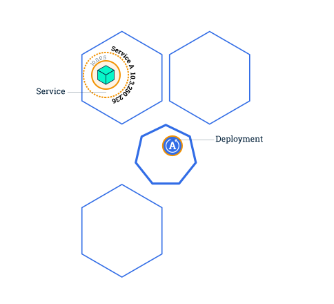

# Application Scaling on Google Kubernetes Engine (GKE)

You can watch the tutorial video for this lab on our Youtube channel [Tutorial Video](https://youtu.be/5KsCxqVWaPg)

This README provides an overview of both horizontal and vertical scaling methods in GKE, guiding you on how to dynamically adjust the number of replicas based on the resource usage like CPU and memory or even custom metrics.
##What is Scaling?

Scaling an application in Kubernetes can be performed either horizontally or vertically. This capability allows your application to handle increases in traffic and loads effectively.
- **Horizontal Scaling (Scaling In/Out)**: This involves increasing or decreasing the number of replicas of your pods to adjust to the workload. Horizontal scaling is suitable for stateless applications where each instance can operate independently.

- **Vertical Scaling (Scaling Up/Down)**: This method involves adding more resources (CPU or memory) to your existing pods. It is useful for state-dependent or legacy applications that are not designed to be horizontally scalable.



## Horizontal Pod Autoscaler (HPA)
The Horizontal Pod Autoscaler automatically adjusts the number of pod replicas in a deployment, replication controller, replica set, or stateful set based on observed CPU utilization (or, with custom metrics support, on some other application-provided metrics).


### Pre-requisites
Before setting up Horizontal Pod Autoscaler (HPA) or Vertical Pod Autoscaler (VPA), it's crucial to ensure that the Metrics Server is active in your cluster. The Metrics Server collects resource metrics from Kubelets and exposes them in Kubernetes API server through Metrics API for use by Horizontal and Vertical Pod Autoscalers.

#### Check Metrics Server Deployment:
Verify that the Metrics Server is deployed in your cluster. You can check its presence by running:
```
kubectl get deployment metrics-server -n kube-system
```
This command checks for the Metrics Server deployment in the 'kube-system' namespace.

### How to Set Up HPA
1. **Define Metrics to Monitor**: Decide on the metrics that HPA will monitor, typically CPU or memory usage.
2. **Apply HPA to Deployment**: Use the following example command to set up autoscaling:
```
apiVersion: autoscaling/v2
kind: HorizontalPodAutoscaler
metadata:
  name: fastapi-app-hpa
  namespace: mlops
spec:
  scaleTargetRef:
    apiVersion: apps/v1
    kind: Deployment
    name: fastapi-app
  minReplicas: 1
  maxReplicas: 5
  metrics:
    - type: Resource
      resource:
        name: cpu
        target:
          type: Utilization
          averageUtilization: 70
  behavior:
    scaleDown:
      stabilizationWindowSeconds: 120
      policies:
        - type: Pods
          value: 1
          periodSeconds: 60
    scaleUp:
      stabilizationWindowSeconds: 60
      policies:
        - type: Pods
          value: 2
          periodSeconds: 60
```
3. **Verify HPA:** Check the status of your HPA using:
```
kubectl get hpa -n <namespace>
```

### How HPA works

In simple terms, HPA works in a “check, update, check again” style loop. Here’s how each of the steps in that loop work.
1. HPA continuously monitors the metrics server for resource usage.
2. Based on the collected resource usage, HPA will calculate the desired number of replicas required.
3. Then, HPA decides to scale up the application to the desired number of replicas.
4. Finally, HPA changes the desired number of replicas.
5. Since HPA is continuously monitoring, the process repeats from Step 1.

## Vertical Pod Autoscaler (VPA)
The Vertical Pod Autoscaler (VPA) frees you from having to manually set up and tune the resource requests for the containers in your pods. It observes the historical and real-time resource usage of your containers and adjusts their CPU and memory requests and limits to better fit the workload.

#### Scaling Up
- If a pod consistently uses more resources than its current allocation, VPA will recommend or automatically increase the resource requests to meet the observed need.
- This prevents issues such as out-of-memory (OOM) kills and CPU throttling, which can degrade the performance and reliability of applications.

#### Scaling Down
- Conversely, if VPA observes that the resources are underutilized — meaning the allocation is consistently higher than the usage — it will recommend or automatically decrease the resource requests.
- This helps in optimizing resource utilization across the cluster, freeing up unused resources that can be allocated to other needy applications or services.

## Practical Considerations
- **Downtime**: Vertical scaling can cause temporary downtime as pods may need to be restarted to allocate new resources.
- **Statefulness**: Horizontal scaling is best for stateless applications, while stateful applications might require more complex strategies like StatefulSets or operator patterns.

## Resources and Further Reading
- Learn more about the basics of scaling applications in Kubernetes from this [tutorial](https://kubernetes.io/docs/tutorials/kubernetes-basics/scale/scale-intro/ "tutorial").
- For adjusting container resources, [visit this guide](https://kubernetes.io/docs/tasks/configure-pod-container/resize-container-resources/ "visit this guide").

