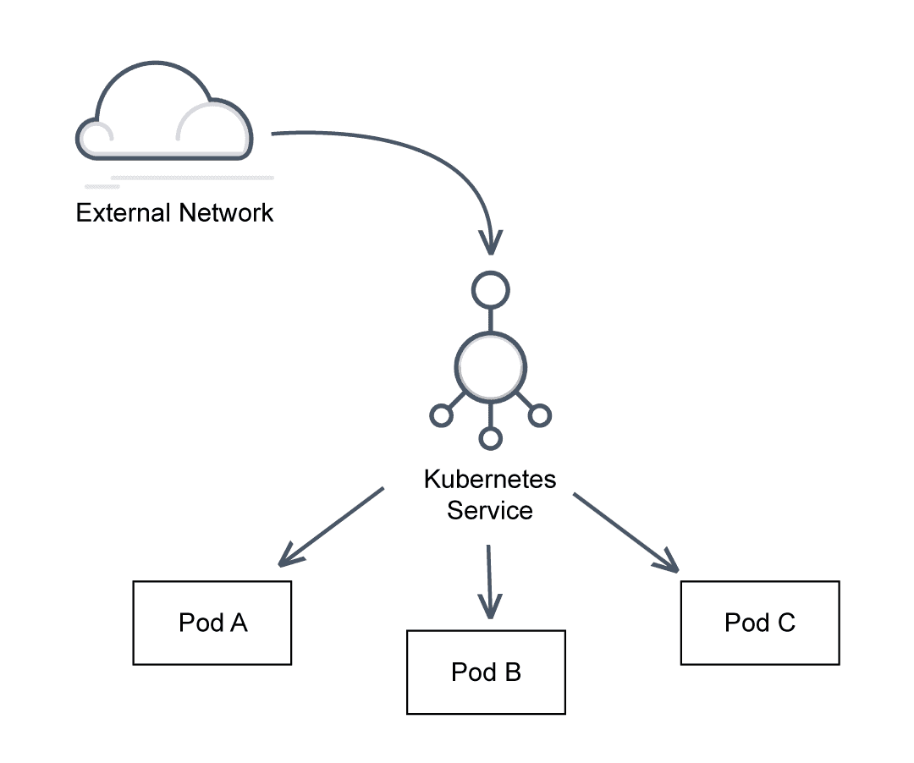

# Kubernetes Networking Lab
In this lab, you will gain hands-on experience with crucial networking concepts in Kubernetes, including cluster networking, service discovery, load balancing, and network policies. This guide will provide you with the necessary commands and usage instructions to navigate through these concepts using Google Kubernetes Engine (GKE).
## Prerequisites
Before you start, make sure you have:
- kubectl installed on your local machine.
- Ensure kubectl is configured on your local machine and connected to your deployed cluster (refer to Lab 1)
- Reviewed all the previous Kuberenets labs already

## Topics covered
This lab consists of four main sections:
- Cluster Networking
- Service Discovery
- Load Balancing
- Network Policies

## 1. Cluster Networking

you will explore how pods communicate with each other across different nodes without the need for network address translation (NAT).
### Steps:
1. Deploy a sample backend application on your Cluster, you can also use the image `heyitsrj/networking-backend-app:v2` for your deployment purpose.
2. Navigate to backend directory and use the following command: (Make sure your namespace is correct, as we are using the initial namespace from Lab 1, if not then you can simply deploy the namespace first using `kubectl apply -f namespace.yaml`)
```
kubectl apply -f deployment.yaml
```
3. Inspect the pods IP address:
```
kubectl get pods -o wide -n <namespace>
```

## 2. Service Discovery

Service objects in Kubernetes facilitate the discovery and routing of traffic to pod instances.
### Steps:
1. Deploy a simple frontend and backend application:
```
kubectl apply -f backend/deployment.yaml
kubectl apply -f frontend/deployment.yaml
```
Before deploying frontend make sure to update the IP address with service endpoint IP in index.html file.
2. Now, simply try to access your frontend application.

## 3. Load Balancing
You will set up an external load balancer to manage incoming traffic to your deployed applications.
1. Create an external load balancer for the frontend:
```
apiVersion: v1
kind: Service
metadata:
  namespace: mlops
  name: frontend-app-service
spec:
  selector:
    app: frontend-app
  ports:
    - name: http
      port: 80
      targetPort: 80
  type: LoadBalancer
```
2. Verify the loadbalancer
```
kubectl get svc frontend-app-service -n <namespace>
```

## 4. Network Policies
Implement network policies to secure the communication between your pods.
### Steps:
1. Apply a network policy to allow traffic only from the frontend to the backend:
```yaml
apiVersion: networking.k8s.io/v1
kind: NetworkPolicy
metadata:
  name: backend-access-policy
  namespace: default
spec:
  podSelector:
    matchLabels:
      app: backend
  policyTypes:
    - Ingress
  ingress:
    - from:
        - podSelector:
            matchLabels:
              app: frontend
      ports:
        - protocol: TCP
          port: 80
```
This policy ensures that only pods labeled with app: frontend can communicate with pods labeled with app: homepage over TCP on port 80, which is typically used for HTTP traffic. Adjust the labels and ports as necessary to fit the specifics of your deployment scenario.

## Conclusion
Through this lab, you've learned how to effectively manage and secure application traffic in Kubernetes using GKE. Experiment with these configurations in your own projects and leverage the skills you've developed here for efficient Kubernetes management.

For further learning, consider exploring the following resources:

- [Kubernetes Networking Overview](https://kubernetes.io/docs/concepts/services-networking/)
- [Creating an External Load Balancer](https://kubernetes.io/docs/tasks/access-application-cluster/create-external-load-balancer/)
- [Kubernetes Services](https://kubernetes.io/docs/concepts/services-networking/service/)
- [Implementing the Kubernetes Network Model](https://kubernetes.io/docs/concepts/cluster-administration/networking/#how-to-implement-the-kubernetes-network-model)

These resources provide a deeper dive into the concepts covered in this lab and will help you broaden your understanding of Kubernetes networking.